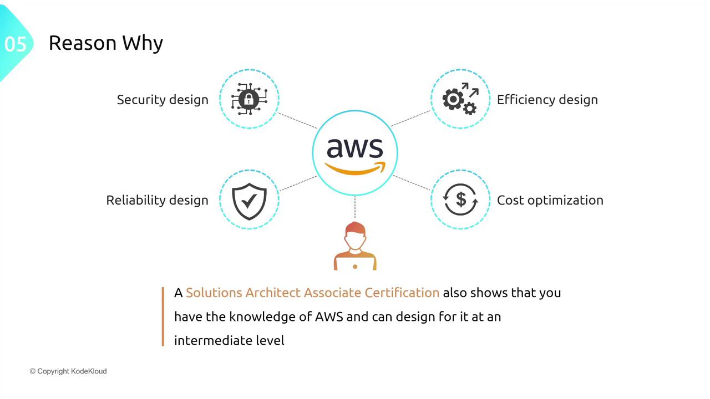

# Course Overview

## Course Content Overview

In this course, you’ll gain a high-level understanding of key AWS service areas:

* Networking
* Storage
* Compute
* Databases
* Application Integration
* Data & Machine Learning
* Migration & Transfer
* Management & Governance
* Security

## Design Section Overview

> Figure: Four Pillars of the AWS Well-Architected Framework

In this section, we shift our focus from individual services to architectural design, following the pillars of the AWS Well-Architected Framework. We cover four key design principles:

* Security: Design secure architectures, implement encryption, control access, and adopt best practices.
* Reliability: Promote fault tolerance, resiliency, and high availability to ensure consistent performance.
* Performance Efficiency: Select and optimize services for scalability, responsiveness, and efficiency.
* Cost Optimization: Manage and reduce costs without compromising performance using AWS cost-management tools and best practices.
