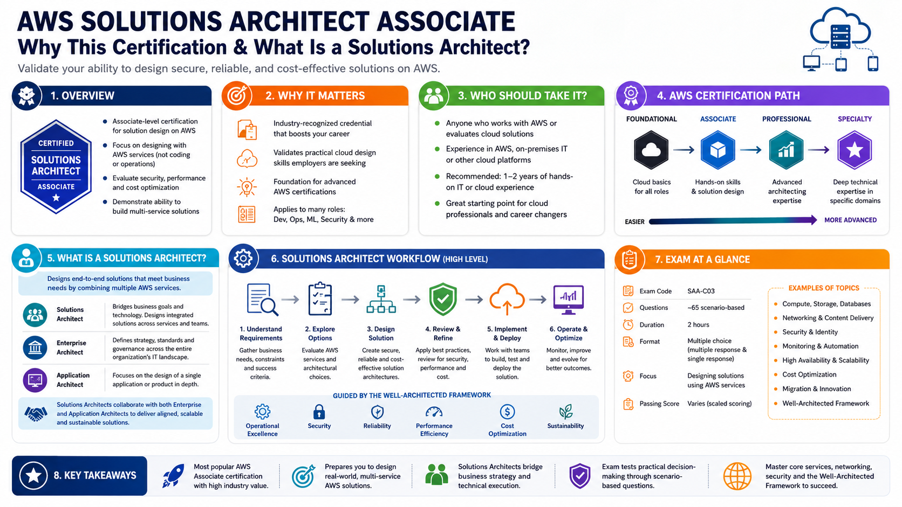
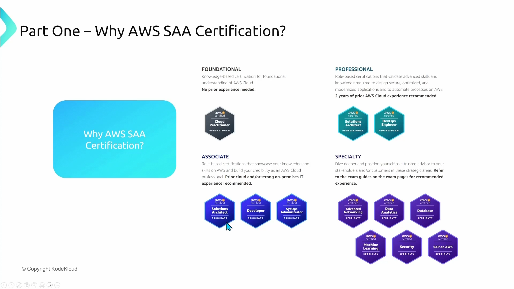
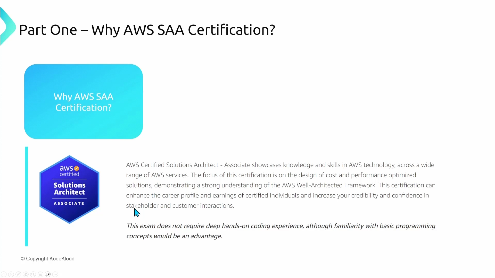
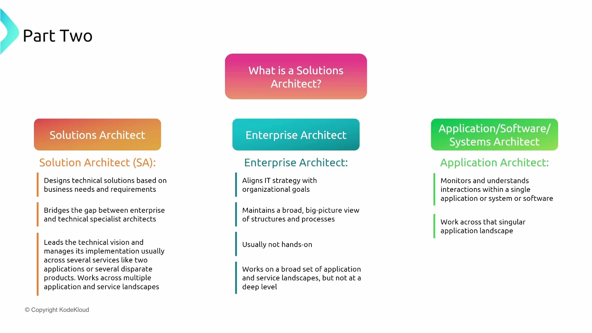
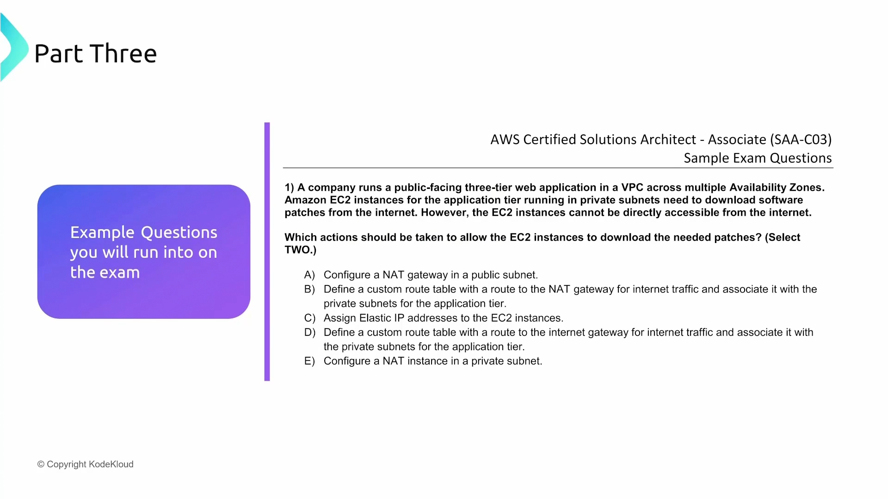
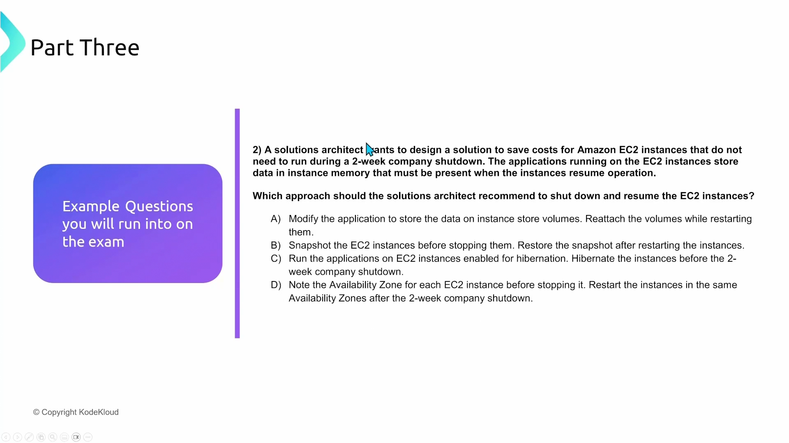
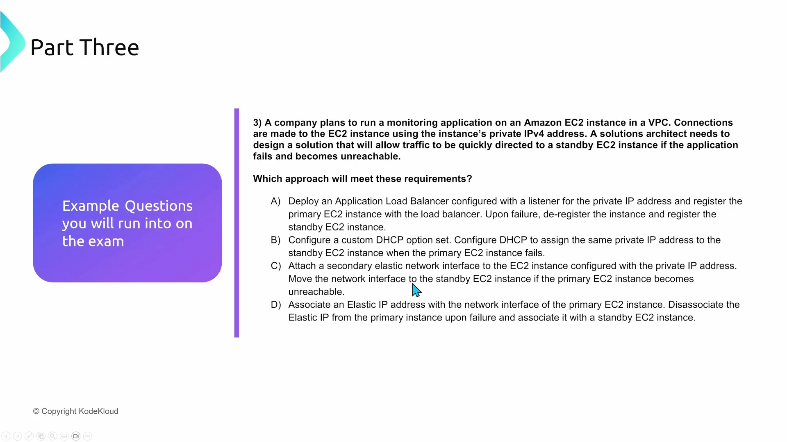
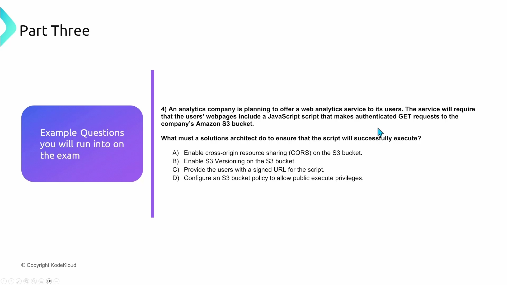

# Why AWS Solutions Architecture Certification and what is a solutions architect

[URL](https://learn.kodekloud.com/user/courses/aws-solutions-architect-associate-certification/module/1a87a522-2fb5-41e9-a36f-0157341c75d9/lesson/ad678e69-fbe7-4fab-8bee-b2f5df4f0ef2)

> Answer: A and B

> Answer: C

> Answer: C

> Answer: C

## Summary

Key exam topics include:
* Designing custom route tables for VPCs
* Exploring connectivity options like VPC peering and transit gateways
* Implementing best practices across various AWS services
