# Default VPC Demo

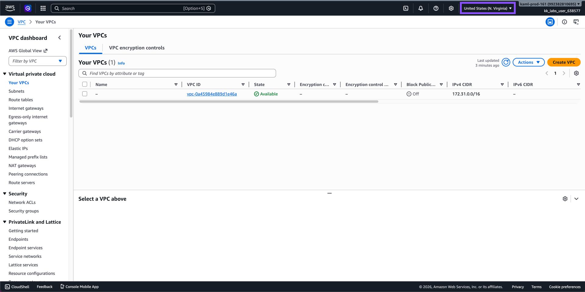
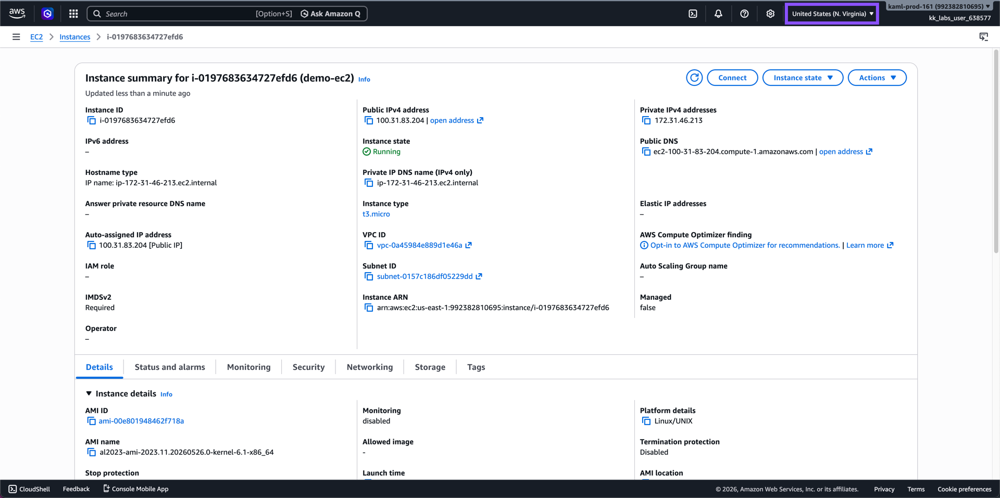

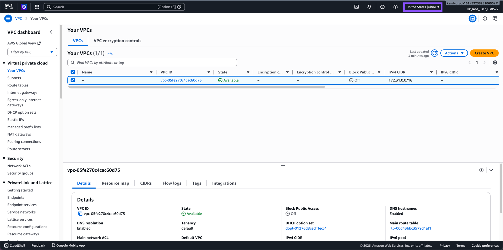
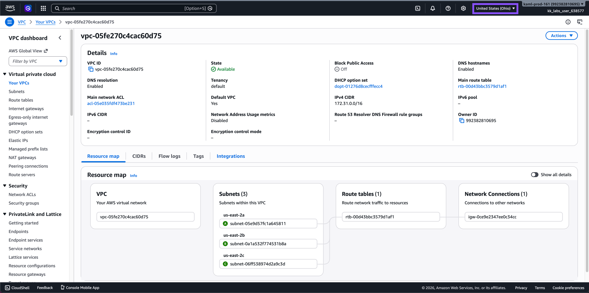
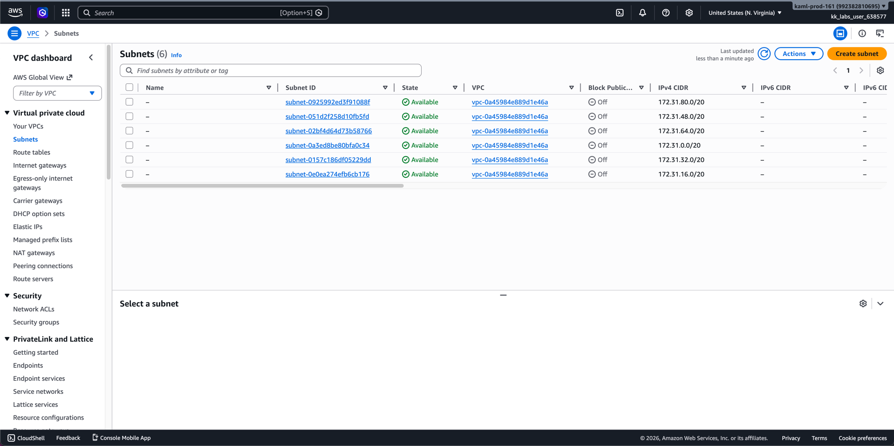
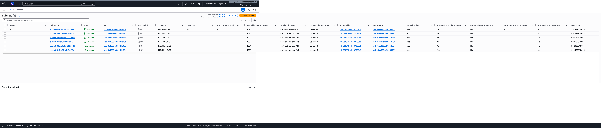
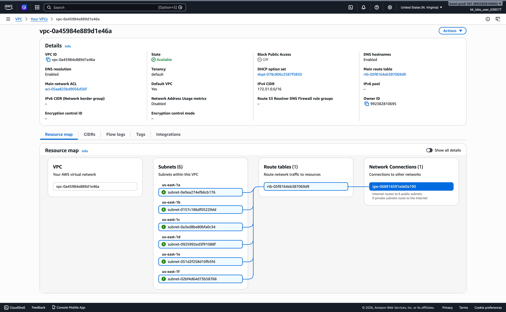
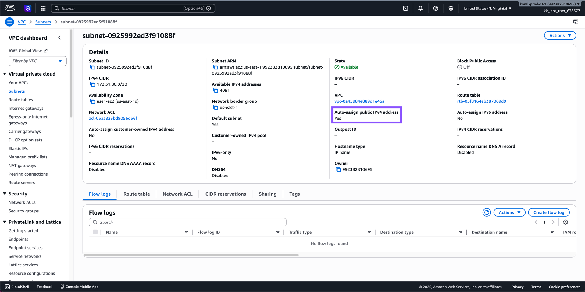
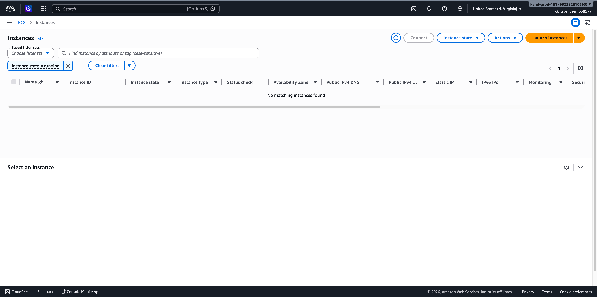
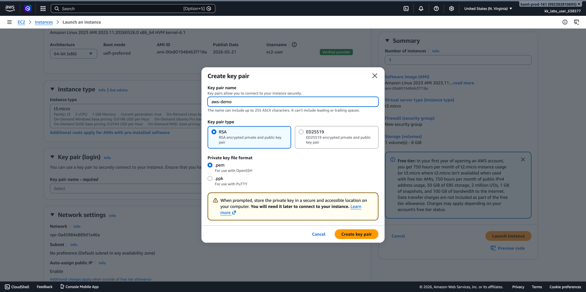
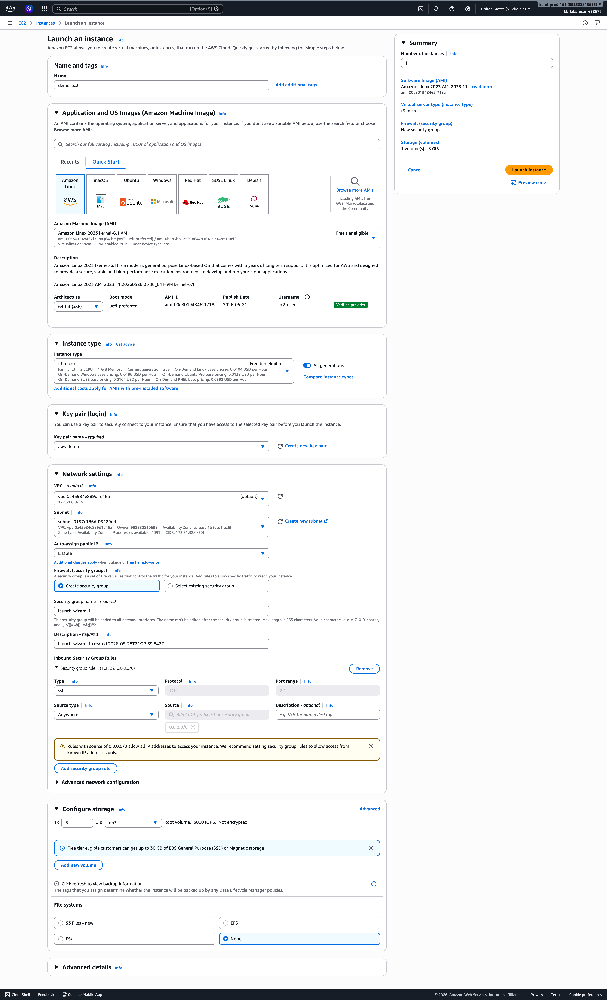
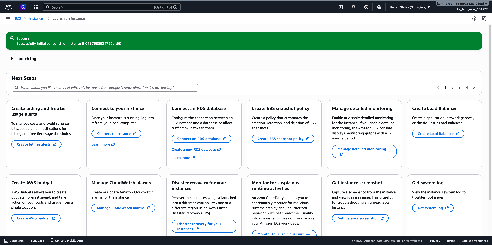
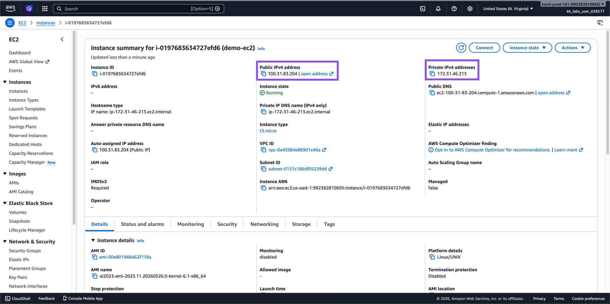
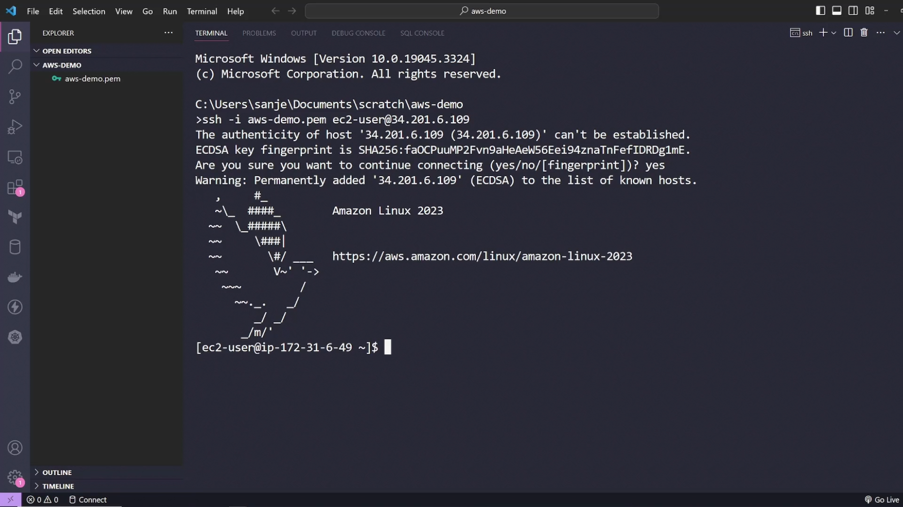

## Troubleshooting

### SSH Permission Denied

```shell
ssh -i aws-demo.pem ec2-user@100.31.83.204

The authenticity of host '100.31.83.204 (100.31.83.204)' can't be established.
ED25519 key fingerprint is SHA256:hsTMqa377F3o61wSDI9NuBfd6TfmDbAt/UvApnjrgUY.
This key is not known by any other names.
Are you sure you want to continue connecting (yes/no/[fingerprint])? yes
Warning: Permanently added '100.31.83.204' (ED25519) to the list of known hosts.
@@@@@@@@@@@@@@@@@@@@@@@@@@@@@@@@@@@@@@@@@@@@@@@@@@@@@@@@@@@
@         WARNING: UNPROTECTED PRIVATE KEY FILE!          @
@@@@@@@@@@@@@@@@@@@@@@@@@@@@@@@@@@@@@@@@@@@@@@@@@@@@@@@@@@@
Permissions 0644 for 'aws-demo.pem' are too open.
It is required that your private key files are NOT accessible by others.
This private key will be ignored.
Load key "aws-demo.pem": bad permissions
ec2-user@100.31.83.204: Permission denied (publickey,gssapi-keyex,gssapi-with-mic).
```

The issue is with the permissions of your private key file `aws-demo.pem`.

SSH requires private keys to be readable only by you. Right now the file has permission `0644`, meaning other users can also read it, so SSH refuses to use it.

You can see it from this line:

```shell
Permissions 0644 for 'aws-demo.pem' are too open.
```

### Fixing the Permission

Fix it with:

```shell
chmod 400 aws-demo.pem
```

or:

```shell
chmod 600 aws-demo.pem
```

Explanation:

* `0644` = owner can read/write, everyone else can read ❌
* `0400` = only owner can read ✅
* `0600` = only owner can read/write ✅

AWS EC2 SSH keys must be private, otherwise SSH ignores them for security reasons.

### SSH into the EC2 Instance

```shell
ssh -i aws-demo.pem ec2-user@100.31.83.204                       ✔ 
   ,     #_
   ~\_  ####_        Amazon Linux 2023
  ~~  \_#####\
  ~~     \###|
  ~~       \#/ ___   https://aws.amazon.com/linux/amazon-linux-2023
   ~~       V~' '->
    ~~~         /
      ~~._.   _/
         _/ _/
       _/m/'
[ec2-user@ip-172-31-46-213 ~]$ 
```
