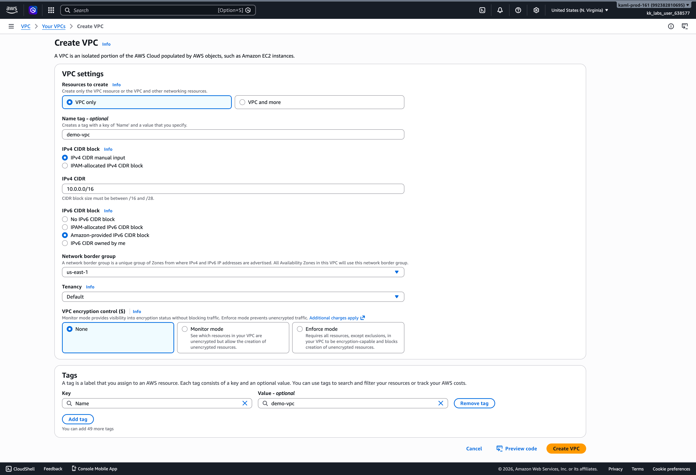
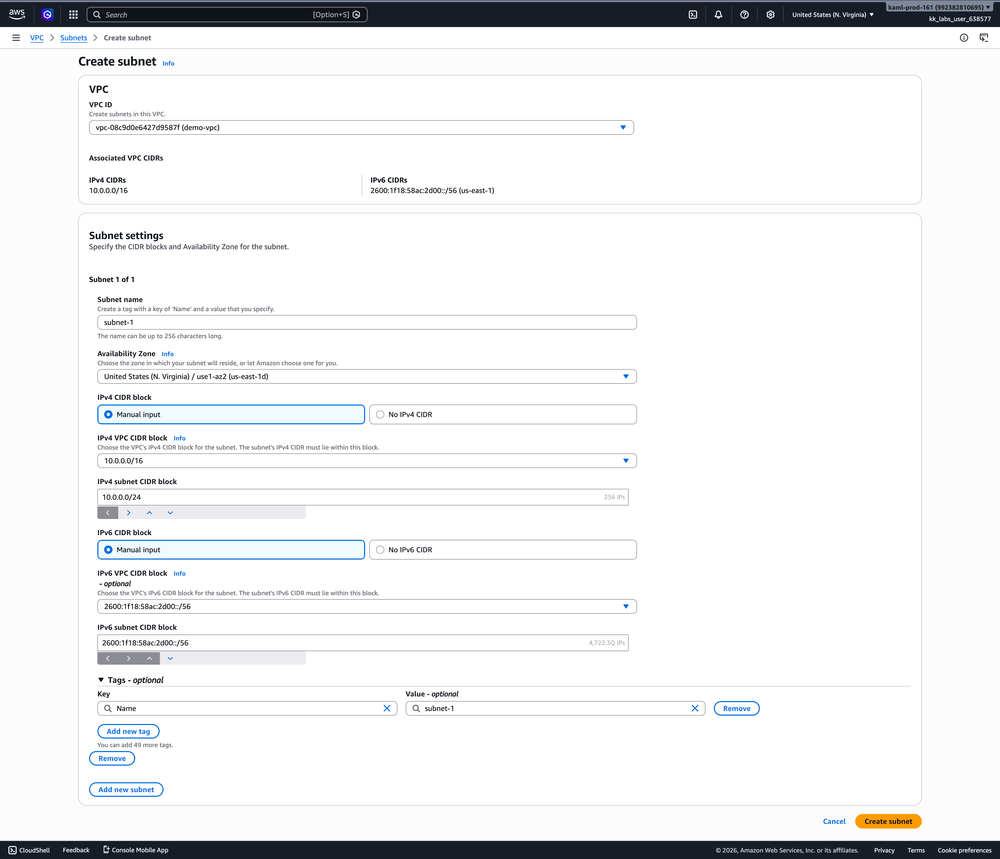
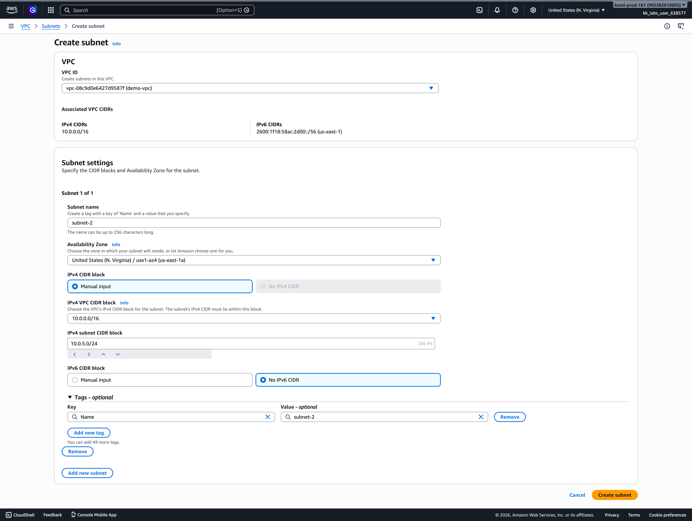
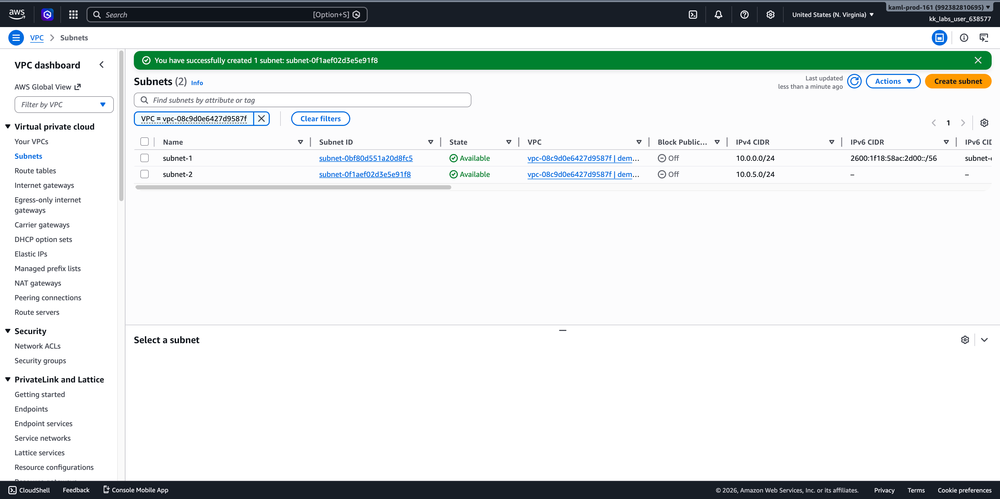
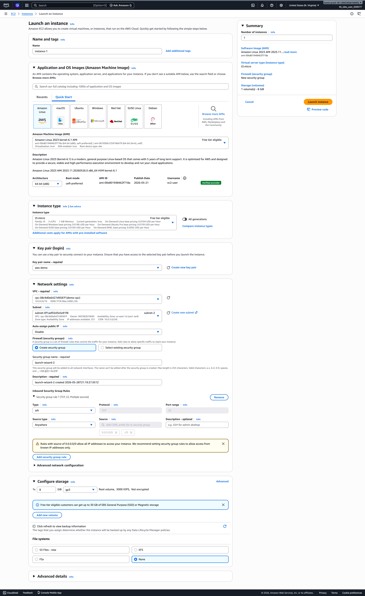
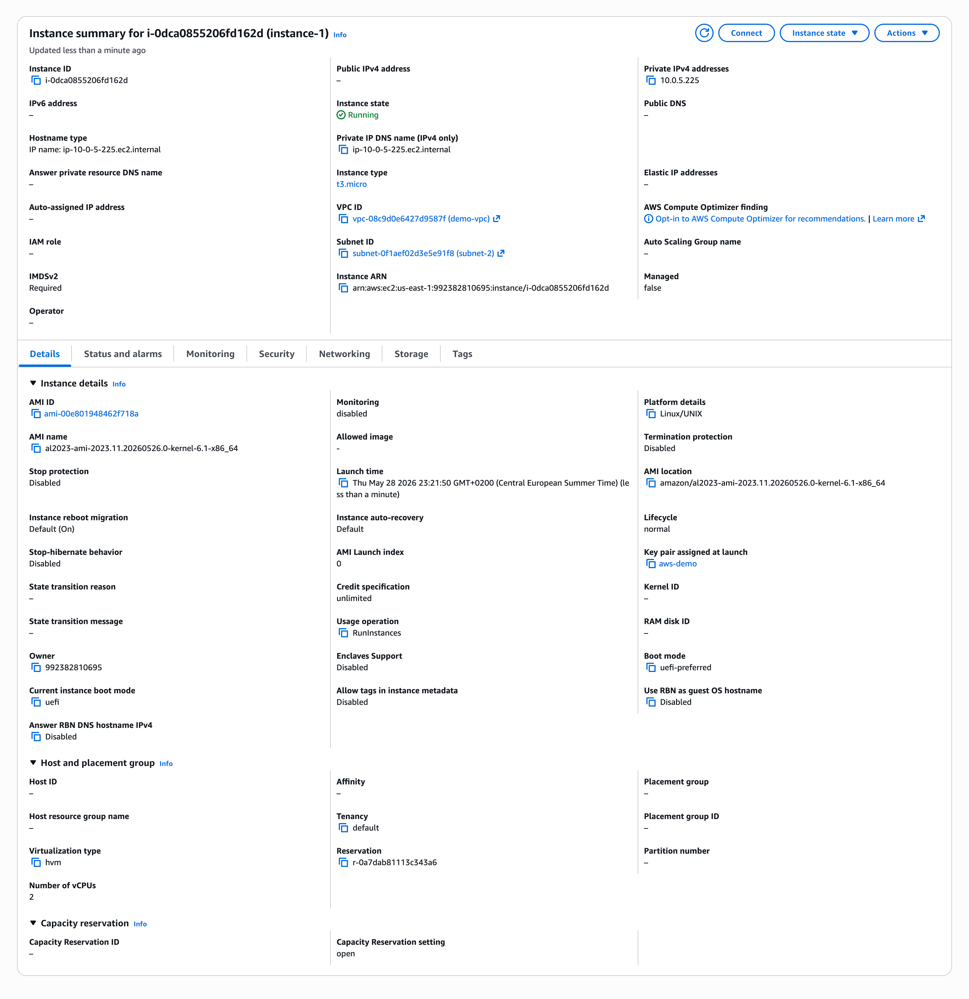
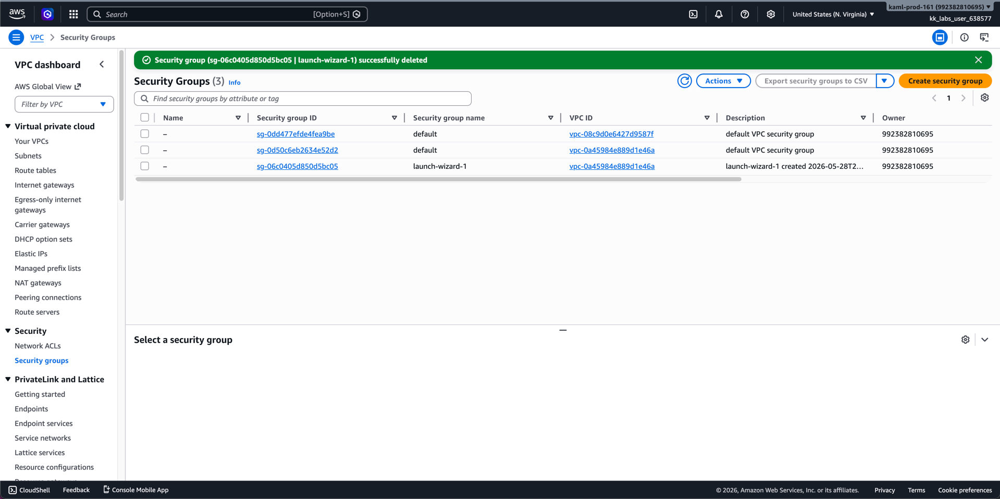

# Subnets Demo

## Cleaning Up

> [!IMPORTANT]
> Delete the VPC, EC2 instance, subnet, and security group you created after the lab is complete to avoid unexpected charges.

> [!TIP]
> Do not delete the default VPC, default subnet, or default security group.
