# Internet Gateways (VPC) Demo

> Copyright: Himel Das. Content is unique.

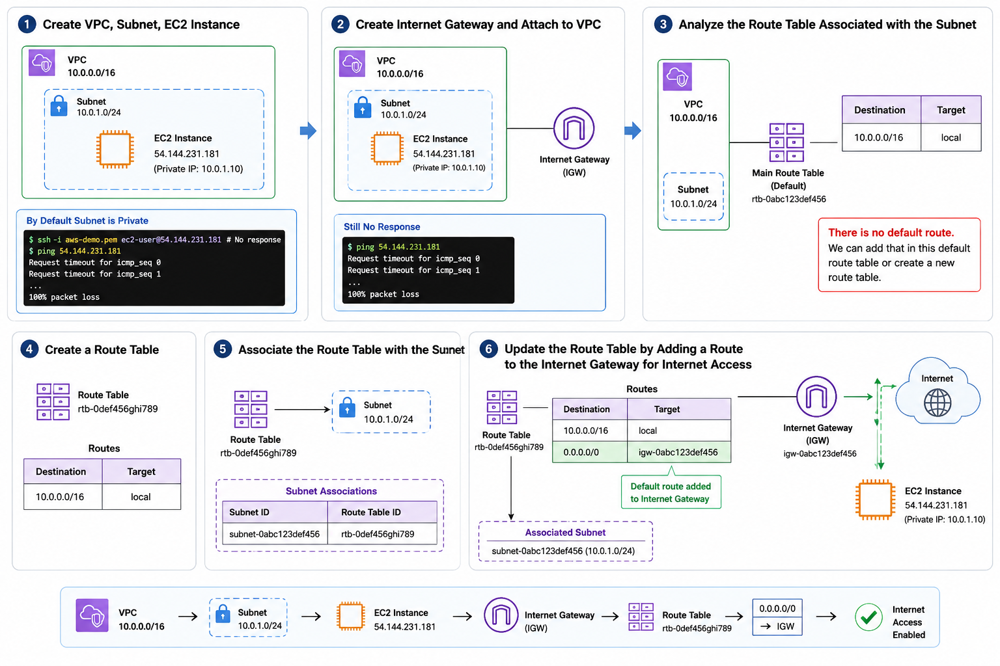
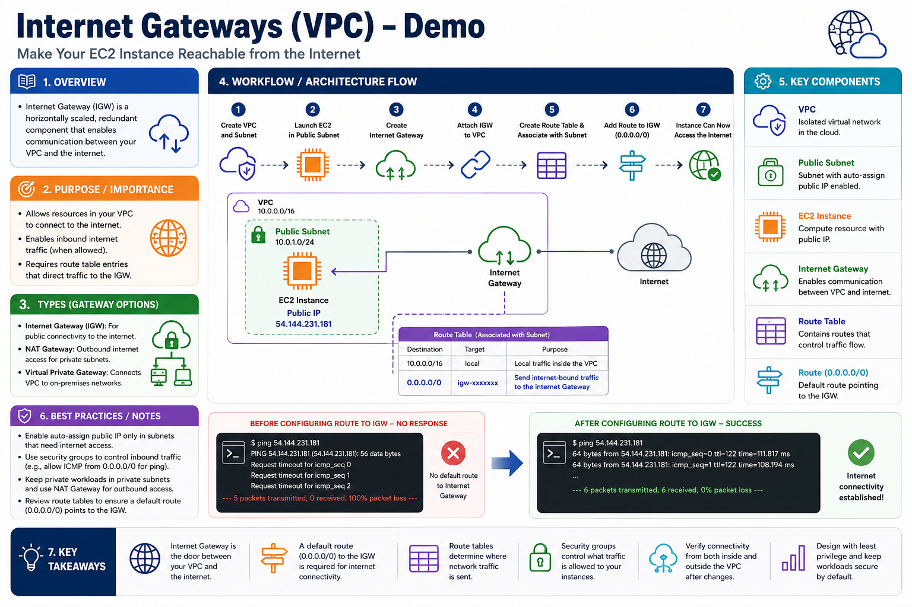

## Lab Diagram

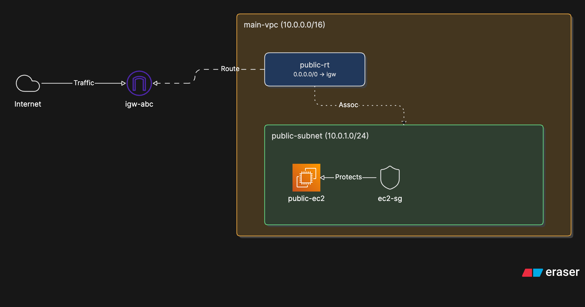

## Create VPC, Subnet, EC2 Instance

### Architecture

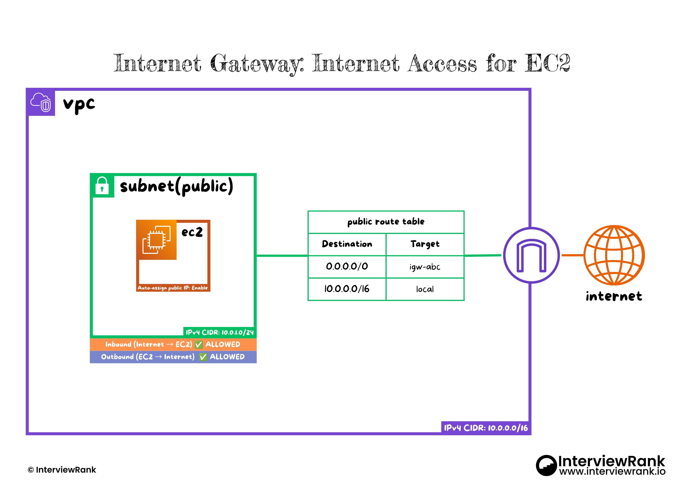

### Implementation

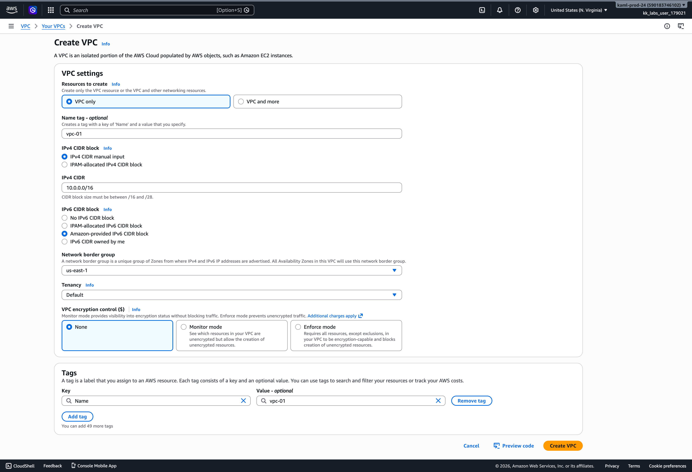
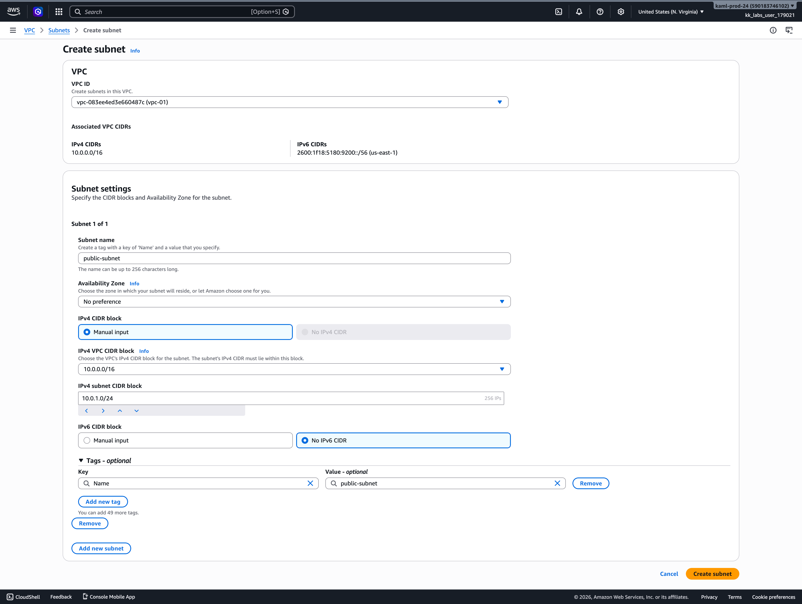

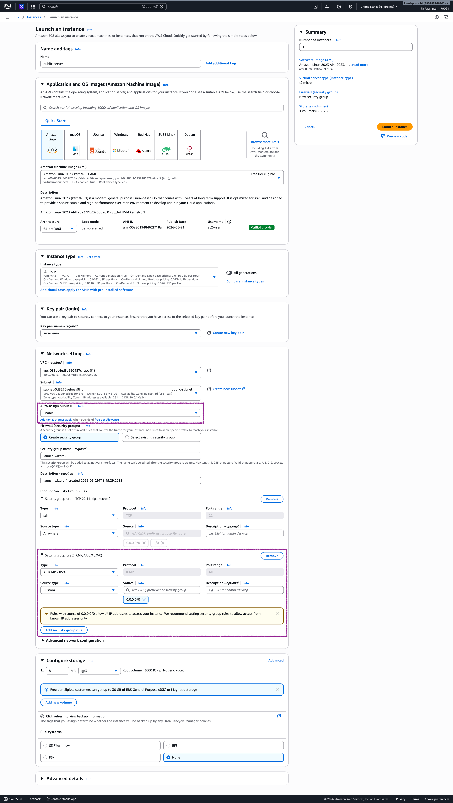

> Enable `Auto-assign public IP` when creating the subnet to assign a public IP address to the EC2 instance.

> Add a Security Group of type `All ICMP - IPv4` with `Source: 0.0.0.0/0` to allow `ping` requests from anywhere.

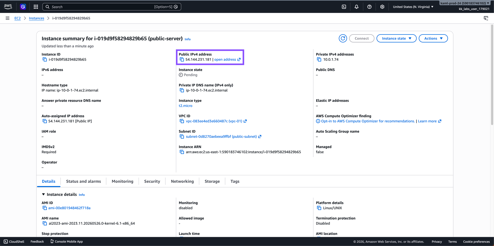

### Subnet is Private by Default

```shell
chmod 400 aws-demo.pem

ssh -i aws-demo.pem ec2-user@54.144.231.181
> No response

ping 54.144.231.181
PING 54.144.231.181 (54.144.231.181): 56 data bytes
Request timeout for icmp_seq 0
Request timeout for icmp_seq 1
Request timeout for icmp_seq 2
Request timeout for icmp_seq 3
--- 54.144.231.181 ping statistics ---
5 packets transmitted, 0 packets received, 100.0% packet loss
```

## Create Internet Gateway

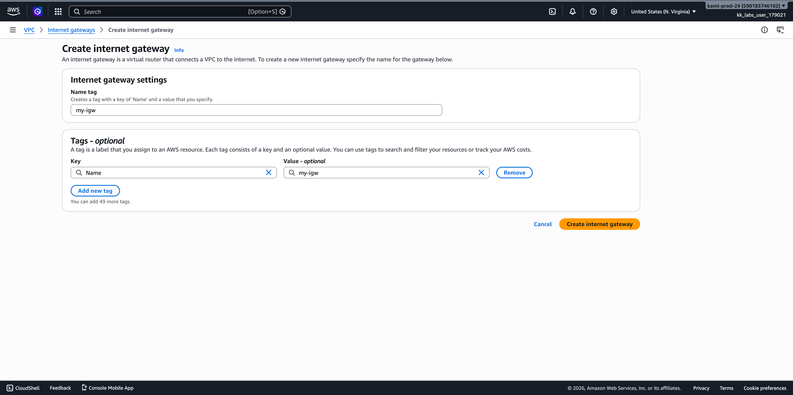
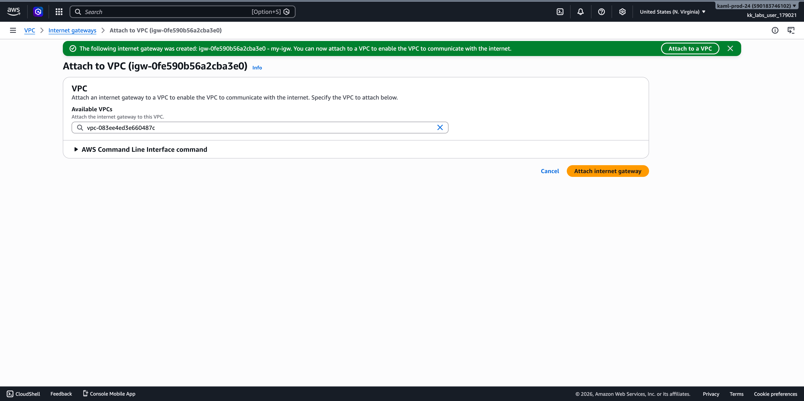
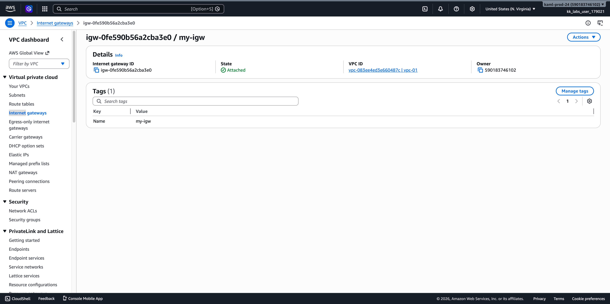

## Still No Response

```shell
ping 54.144.231.181
PING 54.144.231.181 (54.144.231.181): 56 data bytes
Request timeout for icmp_seq 0
Request timeout for icmp_seq 1
Request timeout for icmp_seq 2
Request timeout for icmp_seq 3
Request timeout for icmp_seq 4

--- 54.144.231.181 ping statistics ---
6 packets transmitted, 0 packets received, 100.0% packet loss
```

## Analyze the Route Table Associated with the Subnet

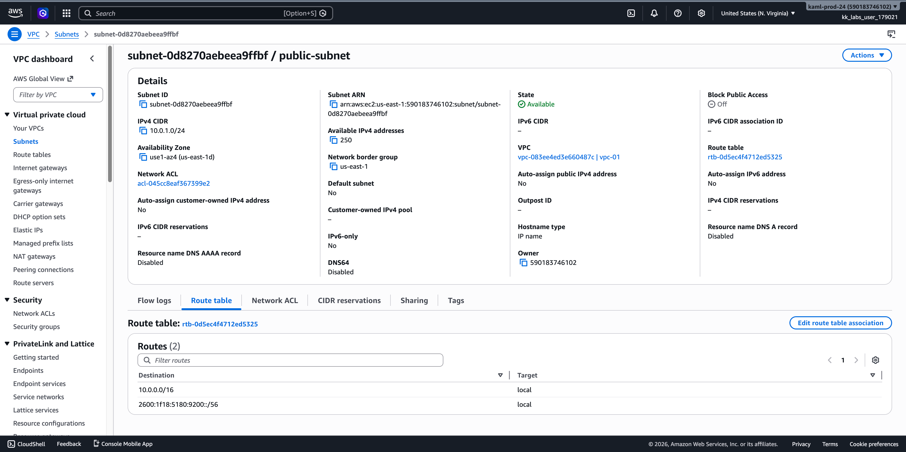

> There is no `default route`. We can add that in this default route table or create a new route table.

## Create a Route Table and Associate it with the Subnet

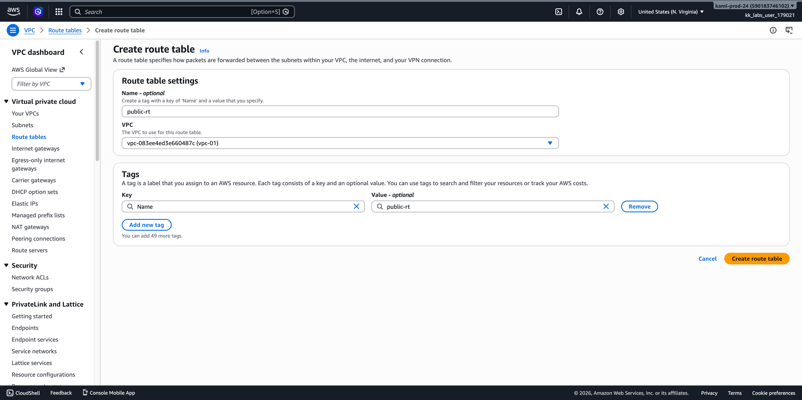

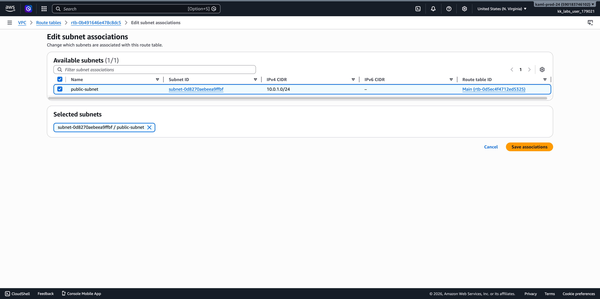


## Update the Route Table by Adding a Route to the Internet Gateway for Internet Access

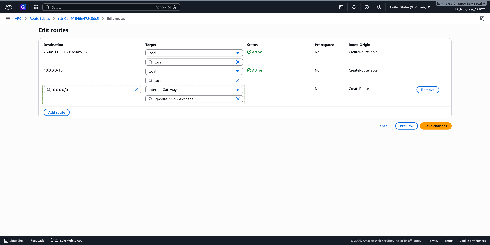
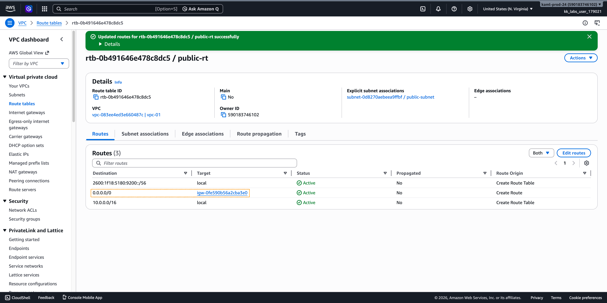

## Now the EC2 Instance can Access the Internet

```shell
ping 54.144.231.181
PING 54.144.231.181 (54.144.231.181): 56 data bytes
64 bytes from 54.144.231.181: icmp_seq=0 ttl=122 time=111.817 ms
64 bytes from 54.144.231.181: icmp_seq=1 ttl=122 time=108.194 ms
64 bytes from 54.144.231.181: icmp_seq=2 ttl=122 time=112.492 ms
64 bytes from 54.144.231.181: icmp_seq=3 ttl=122 time=110.363 ms
64 bytes from 54.144.231.181: icmp_seq=4 ttl=122 time=108.705 ms
64 bytes from 54.144.231.181: icmp_seq=5 ttl=122 time=111.421 ms

--- 54.144.231.181 ping statistics ---
6 packets transmitted, 6 packets received, 0.0% packet loss
round-trip min/avg/max/stddev = 108.194/110.499/112.492/1.587 ms
```
