# 11 NAT Gateways (VPC) Demo

## Idea

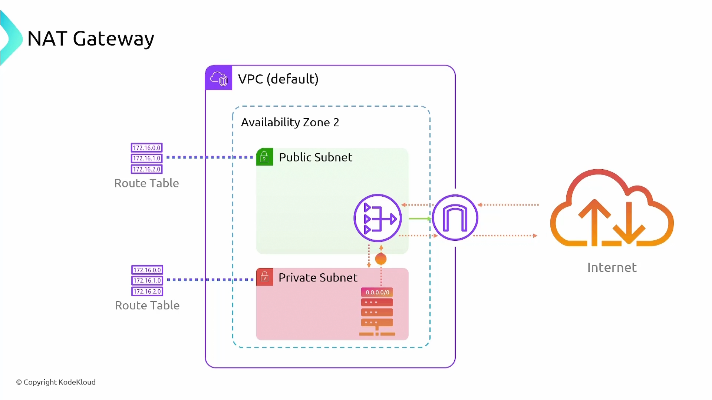

## Architecture

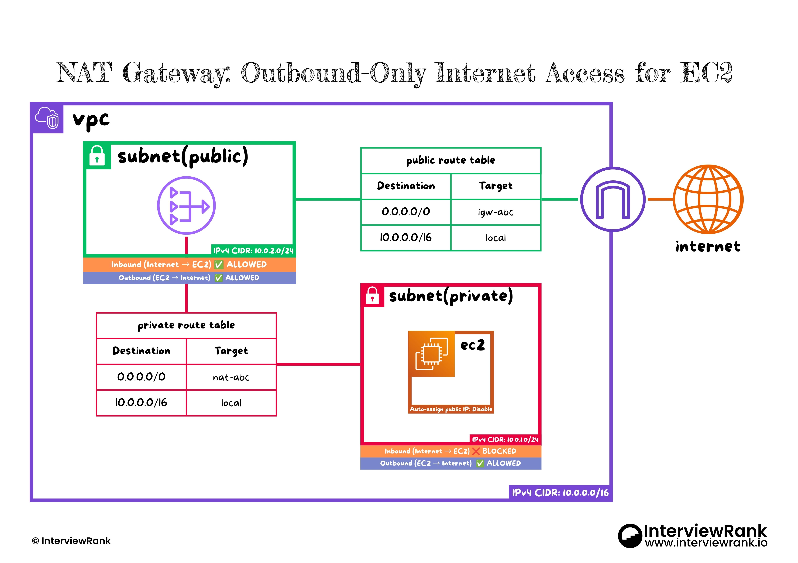

## Implementation

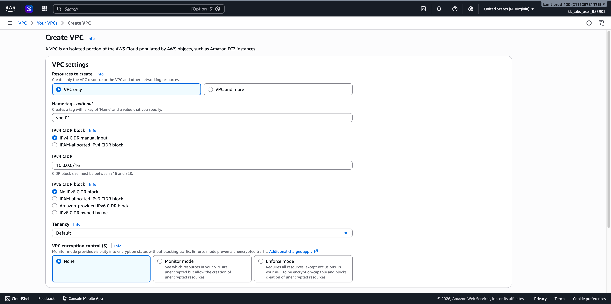
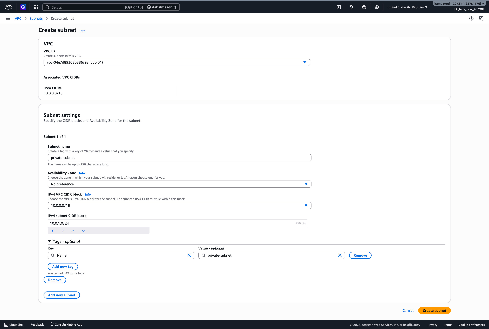
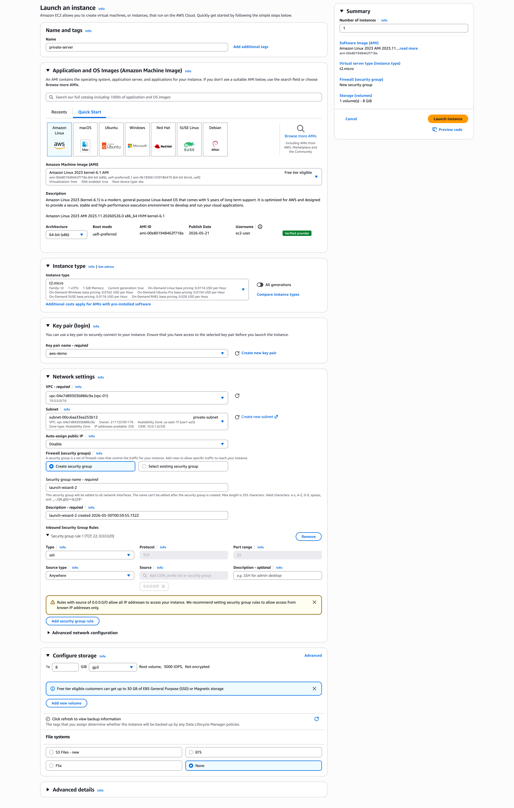
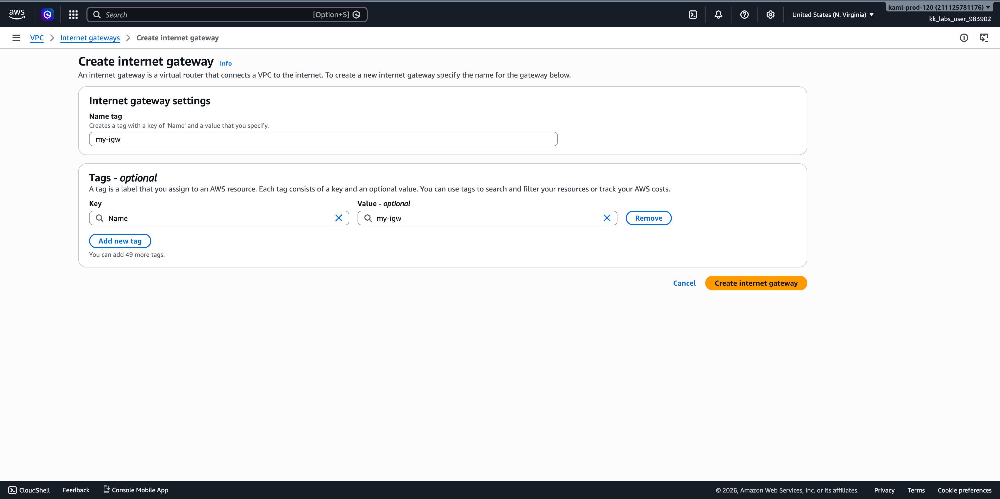
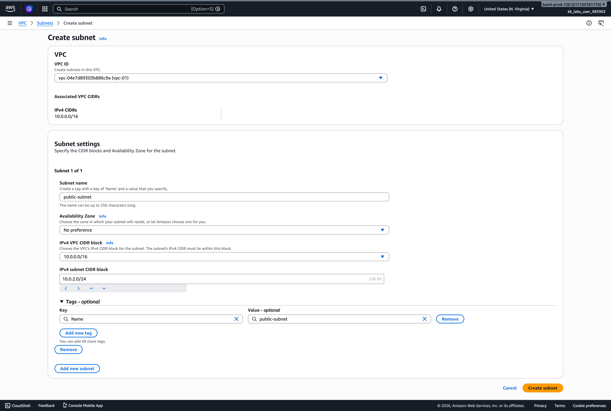
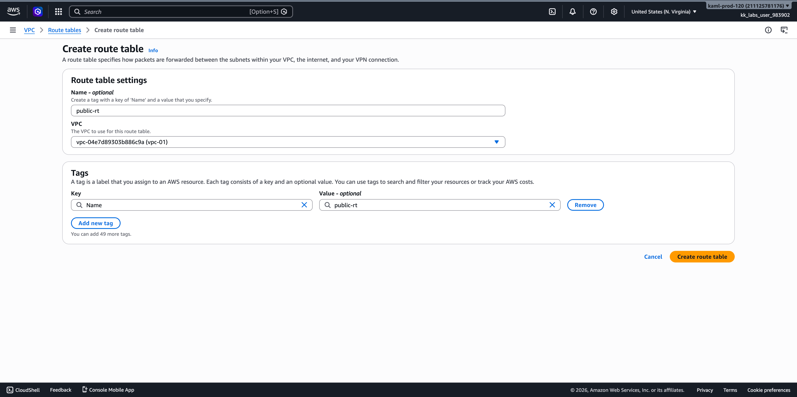
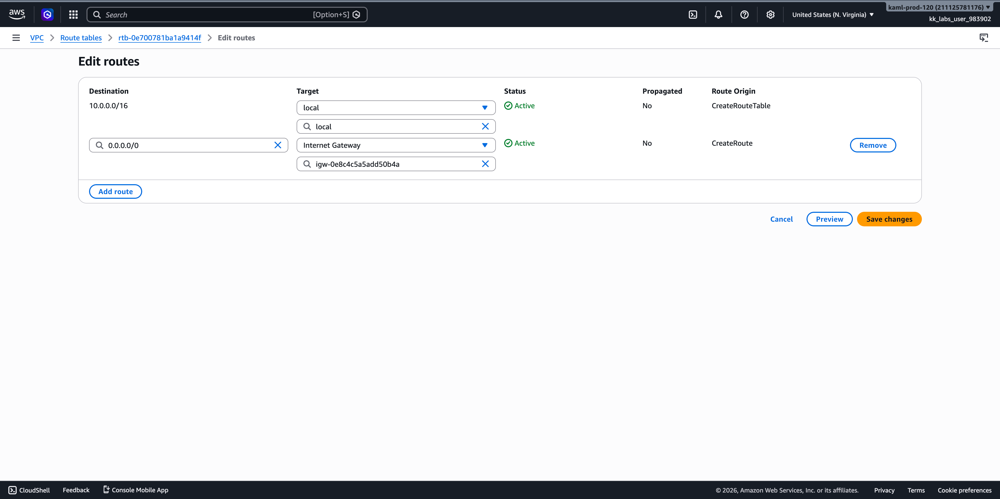
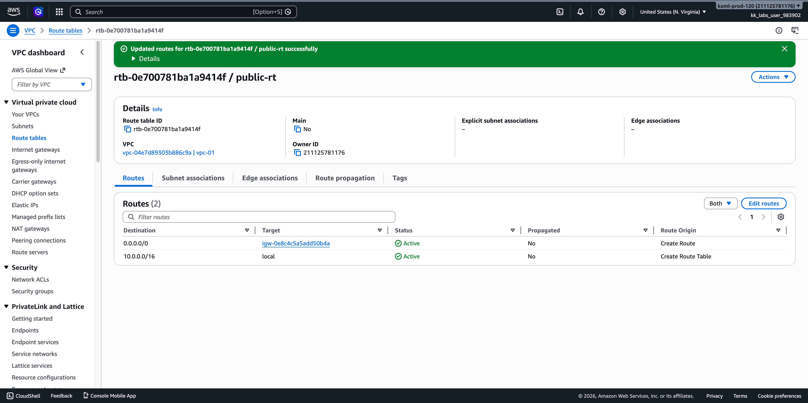
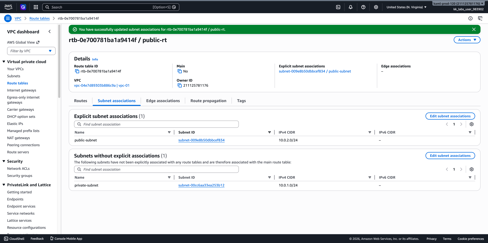
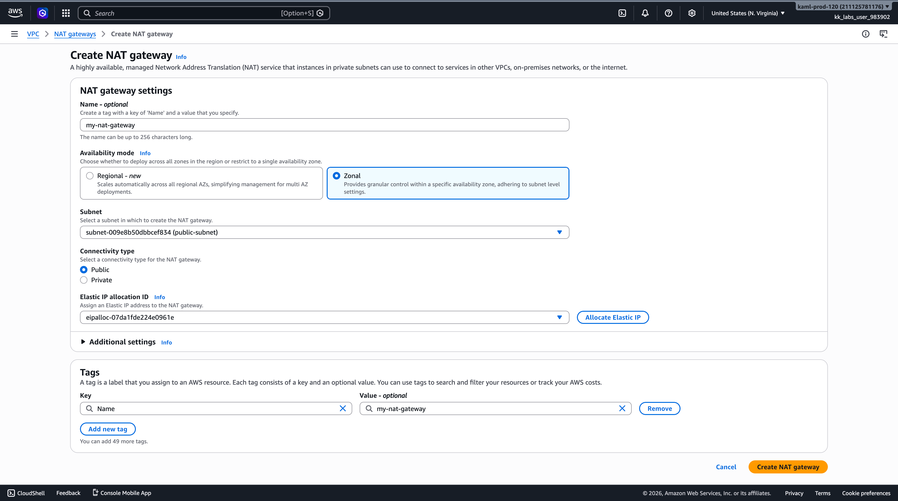

**This Configuration:**
- Name: `my-nat-gateway`
- Mode: **Zonal**
- Subnet: `subnet-009e8b50dbbcef834` (public-subnet)
- Connectivity: **Public**
- Elastic IP: `eipalloc-07da1fde224e0961e`

**Regional Availability Mode for NAT Gateways**

AWS has introduced a **Regional** availability mode for NAT gateways, alongside the existing **Zonal** mode.

**Modes**
- 🌐 Regional *(New)*: Automatically scales across all AZs in the region. Simplifies setup for multi-AZ architectures - no need to deploy one gateway per AZ.
- 🏢 Zonal: Scoped to a single AZ and subnet. Offers granular control and keeps traffic within the zone. Best when AZ-level isolation is required.

**When to use Regional:** New VPCs or workloads where operational simplicity matters more than per-AZ traffic control. Reduces the number of Elastic IPs and route table entries to manage.

**When to prefer Zonal:** Use when you need traffic to stay within a specific AZ — for cost control, compliance, or fault isolation. Useful when cross-AZ data transfer charges are a concern.

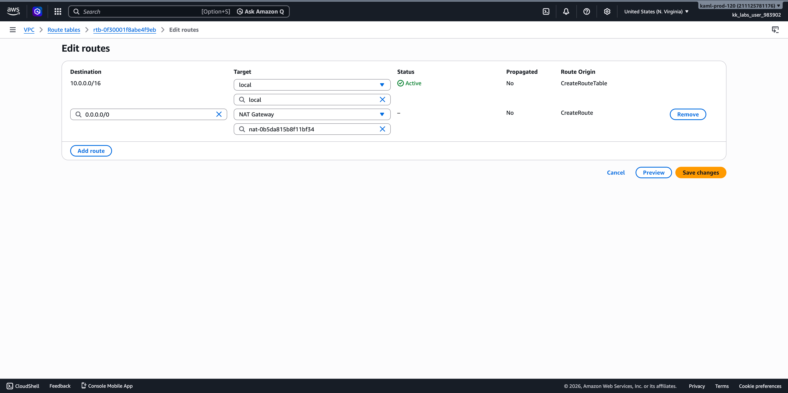
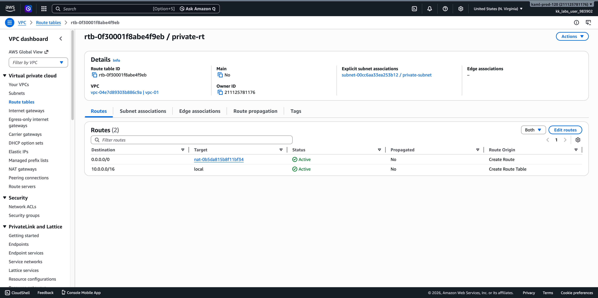
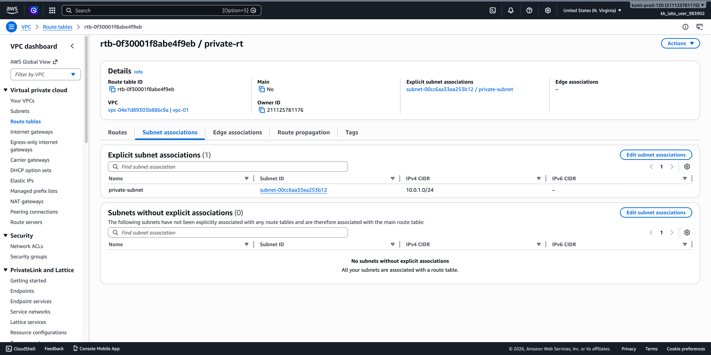
