# DNS VPC (Demo)

## Definitions

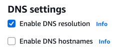

- The DNS resolution attribute determines whether DNS resolution through the Amazon DNS server is supported for the VPC.
- The DNS hostnames attribute determines whether instances launched in the VPC receive public DNS hostnames that correspond to their public IP addresses.

> Source: AWS

## Architecture


## Implementation

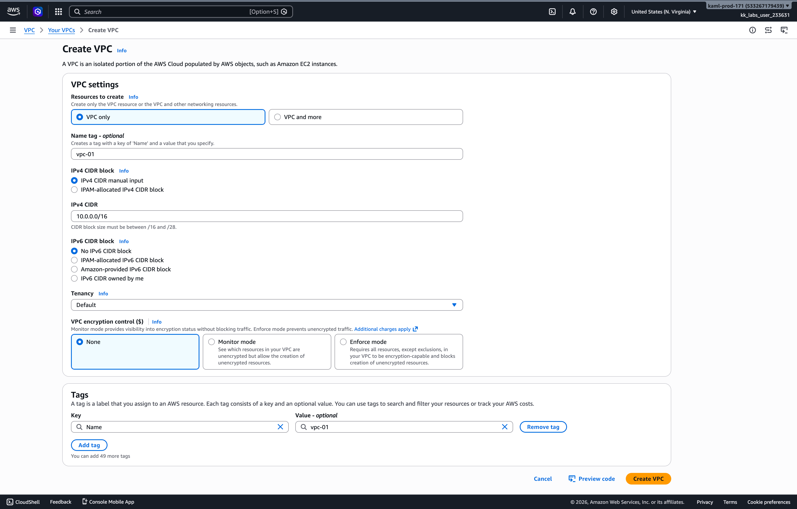
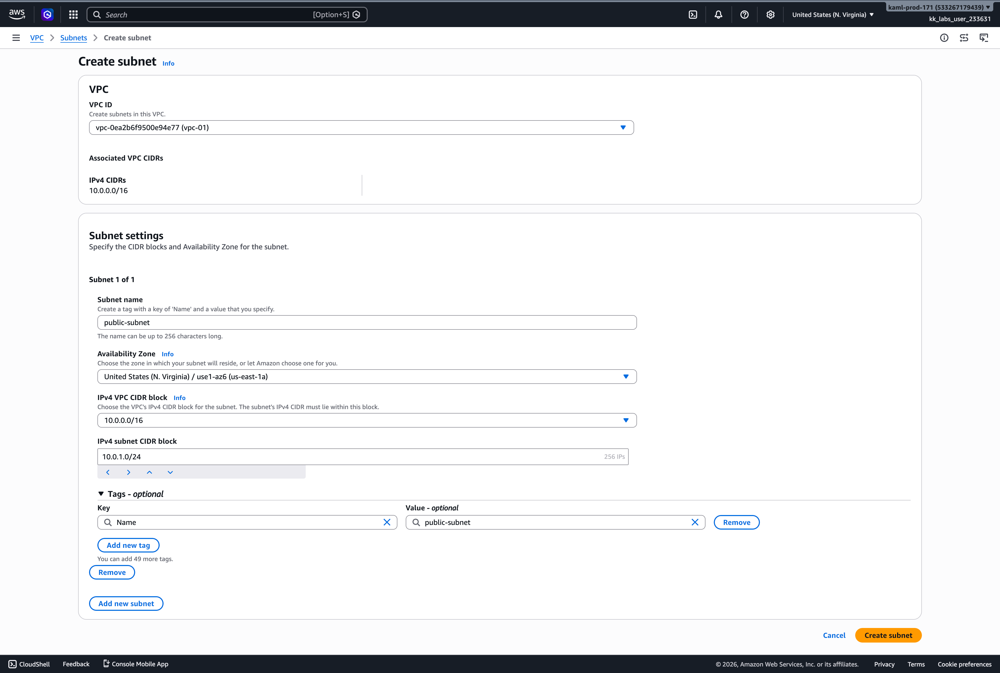
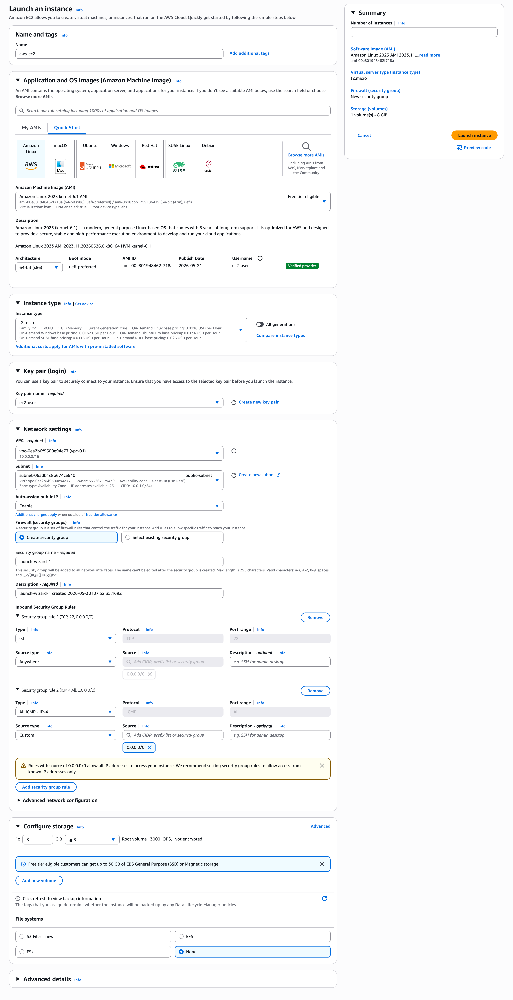
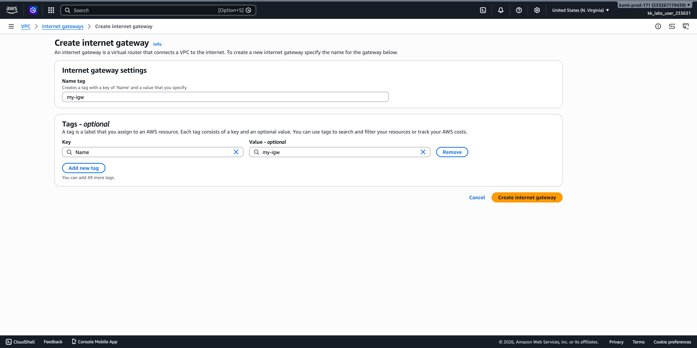
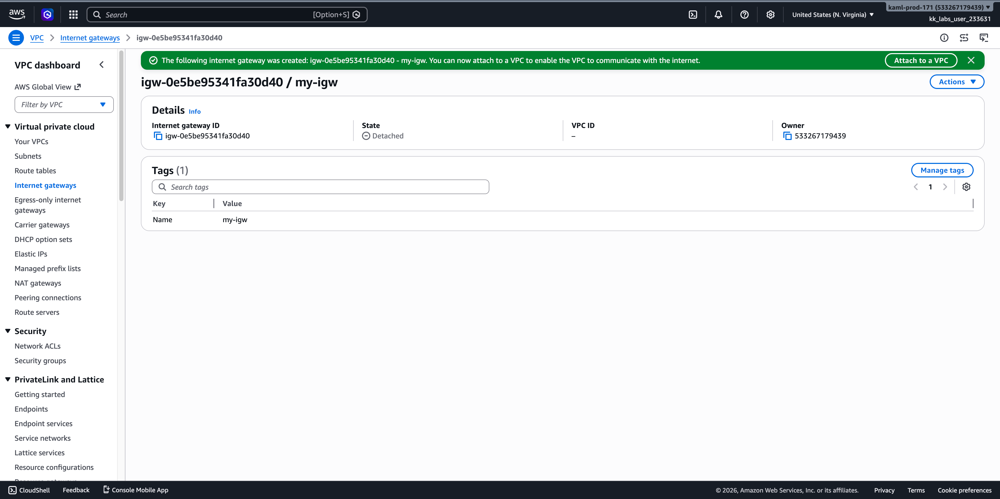
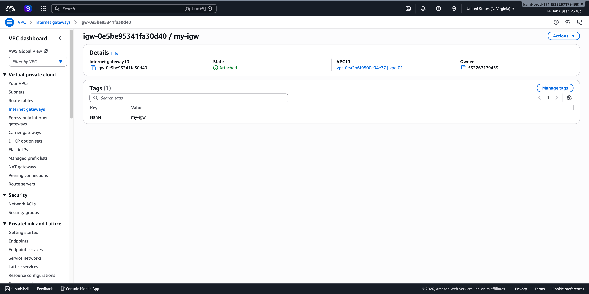
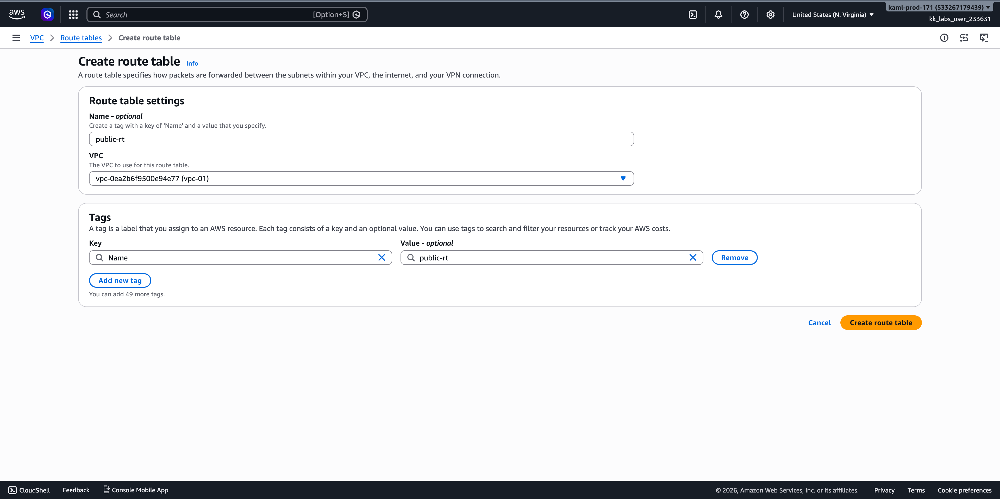
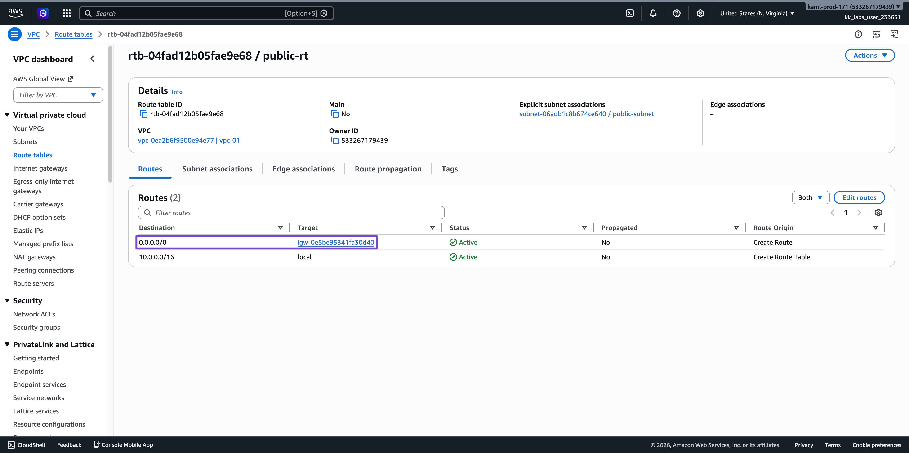
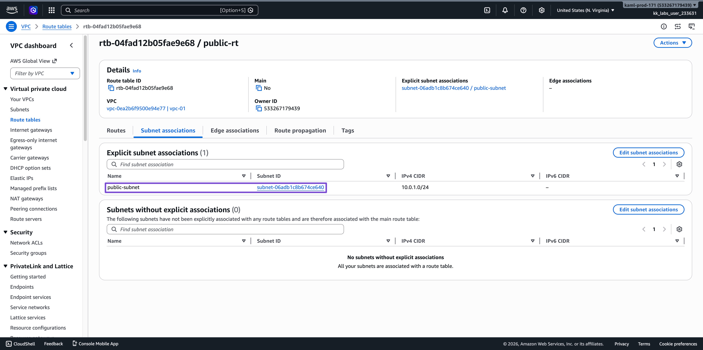
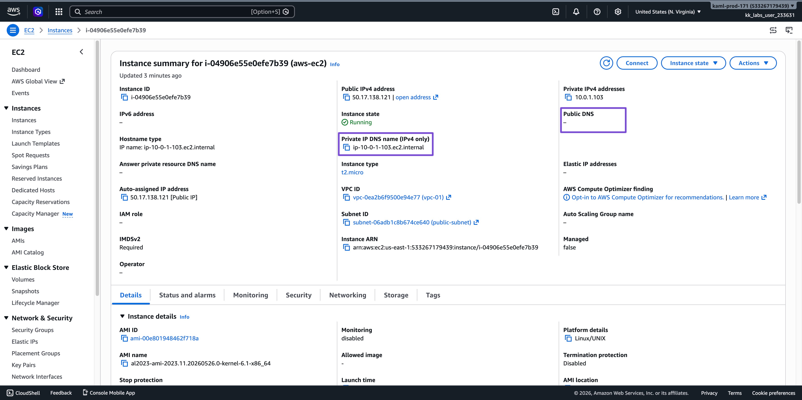
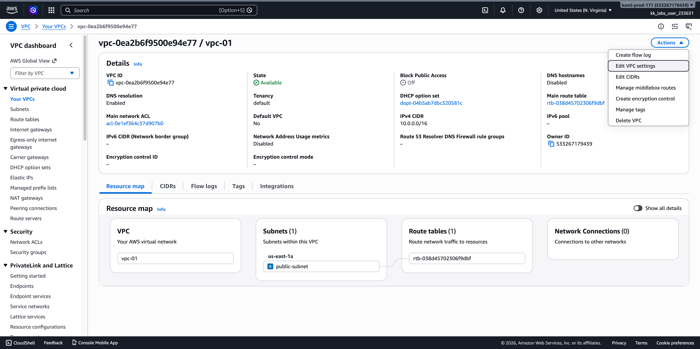
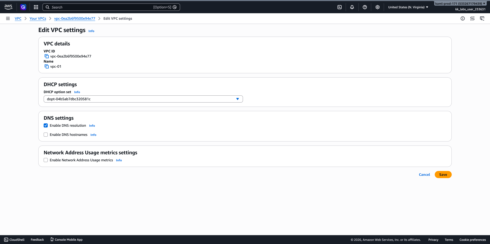
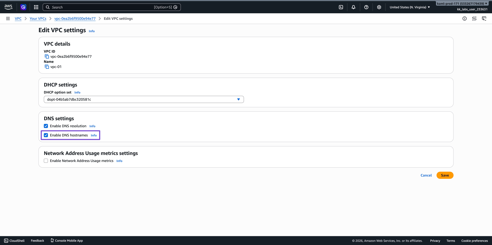
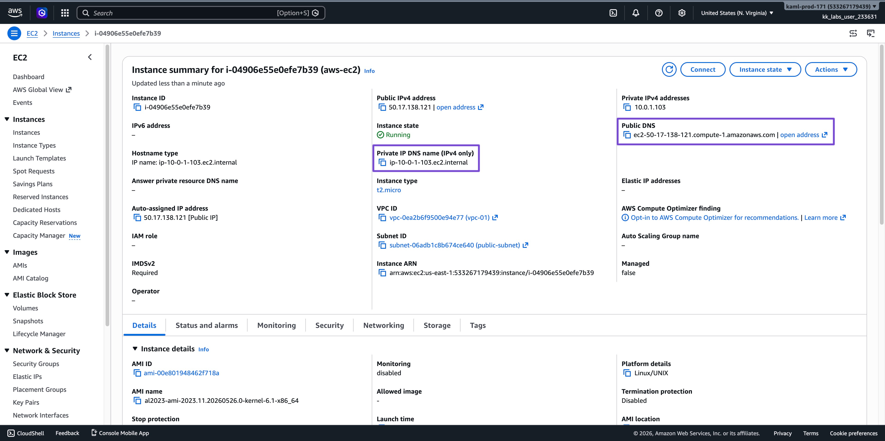

## Testing the DNS Resolution

### Inbound Traffic

```shell
$ ping -c 4 ec2-50-17-138-121.compute-1.amazonaws.com

PING ec2-50-17-138-121.compute-1.amazonaws.com (50.17.138.121): 56 data bytes
64 bytes from 50.17.138.121: icmp_seq=0 ttl=122 time=109.047 ms
64 bytes from 50.17.138.121: icmp_seq=1 ttl=122 time=110.644 ms
64 bytes from 50.17.138.121: icmp_seq=2 ttl=122 time=109.677 ms
64 bytes from 50.17.138.121: icmp_seq=3 ttl=122 time=109.685 ms

--- ec2-50-17-138-121.compute-1.amazonaws.com ping statistics ---
4 packets transmitted, 4 packets received, 0.0% packet loss
round-trip min/avg/max/stddev = 109.047/109.763/110.644/0.571 ms
```

### Outbound Traffic

````shell
$ ssh -i "ec2-user.pem" ec2-user@ec2-50-17-138-121.compute-1.amazonaws.com 

   ,     #_
   ~\_  ####_        Amazon Linux 2023
  ~~  \_#####\
  ~~     \###|
  ~~       \#/ ___   https://aws.amazon.com/linux/amazon-linux-2023
   ~~       V~' '->
    ~~~         /
      ~~._.   _/
         _/ _/
       _/m/'

[ec2-user@ip-10-0-1-103 ~]$ ping -c 4 www.google.com

PING www.google.com (142.251.156.119) 56(84) bytes of data.
64 bytes from 142.251.156.119 (142.251.156.119): icmp_seq=1 ttl=117 time=1.16 ms
64 bytes from 142.251.156.119 (142.251.156.119): icmp_seq=2 ttl=117 time=1.17 ms
64 bytes from 142.251.156.119 (142.251.156.119): icmp_seq=3 ttl=117 time=1.31 ms
64 bytes from 142.251.156.119 (142.251.156.119): icmp_seq=4 ttl=117 time=1.15 ms

--- www.google.com ping statistics ---
4 packets transmitted, 4 received, 0% packet loss, time 3005ms
rtt min/avg/max/mdev = 1.153/1.197/1.306/0.062 ms
[ec2-user@ip-10-0-1-103 ~]$ 
````

### DNS Resolution

```shell
[ec2-user@ip-10-0-1-103 ~]$ cat /etc/resolv.conf
# This is /run/systemd/resolve/resolv.conf managed by man:systemd-resolved(8).
# Do not edit.
#
# This file might be symlinked as /etc/resolv.conf. If you're looking at
# /etc/resolv.conf and seeing this text, you have followed the symlink.
#
# This is a dynamic resolv.conf file for connecting local clients directly to
# all known uplink DNS servers. This file lists all configured search domains.
#
# Third party programs should typically not access this file directly, but only
# through the symlink at /etc/resolv.conf. To manage man:resolv.conf(5) in a
# different way, replace this symlink by a static file or a different symlink.
#
# See man:systemd-resolved.service(8) for details about the supported modes of
# operation for /etc/resolv.conf.

nameserver 10.0.0.2
search ec2.internal
```

#### AWS VPC DNS Resolver (`10.0.0.2`)

AWS reserves **VPC base CIDR + 2** as the built-in DNS server.

**Responsibilities:**
- Resolves internal EC2 hostnames (e.g. `ip-10-0-1-103.ec2.internal`)
- Resolves private Route 53 hosted zones
- Forwards public DNS queries to the internet
- Handles Route 53 Resolver rules for hybrid (on-prem ↔ AWS) DNS

**Pattern:**
| VPC CIDR | DNS Resolver |
|---|---|
| `10.0.0.0/16` | `10.0.0.2` |
| `172.31.0.0/16` | `172.31.0.2` |
| `192.168.0.0/16` | `192.168.0.2` |

**`search ec2.internal`** — appends `.ec2.internal` to short hostnames; the default private DNS zone for `us-east-1`.

> Also reachable via `169.254.169.253` from any EC2 instance regardless of VPC CIDR.

### DNS Lookup for Google

```shell
[ec2-user@ip-10-0-1-103 ~]$ nslookup google.com
Server:         10.0.0.2
Address:        10.0.0.2#53

Non-authoritative answer:
Name:   google.com
Address: 192.178.155.113
Name:   google.com
Address: 192.178.155.138
Name:   google.com
Address: 192.178.155.139
Name:   google.com
Address: 192.178.155.100
Name:   google.com
Address: 192.178.155.101
Name:   google.com
Address: 192.178.155.102
Name:   google.com
Address: 2607:f8b0:4004:c23::64
Name:   google.com
Address: 2607:f8b0:4004:c23::66
Name:   google.com
Address: 2607:f8b0:4004:c23::71
Name:   google.com
Address: 2607:f8b0:4004:c23::8b

[ec2-user@ip-10-0-1-103 ~]$
```

### Disable DNS Resolution

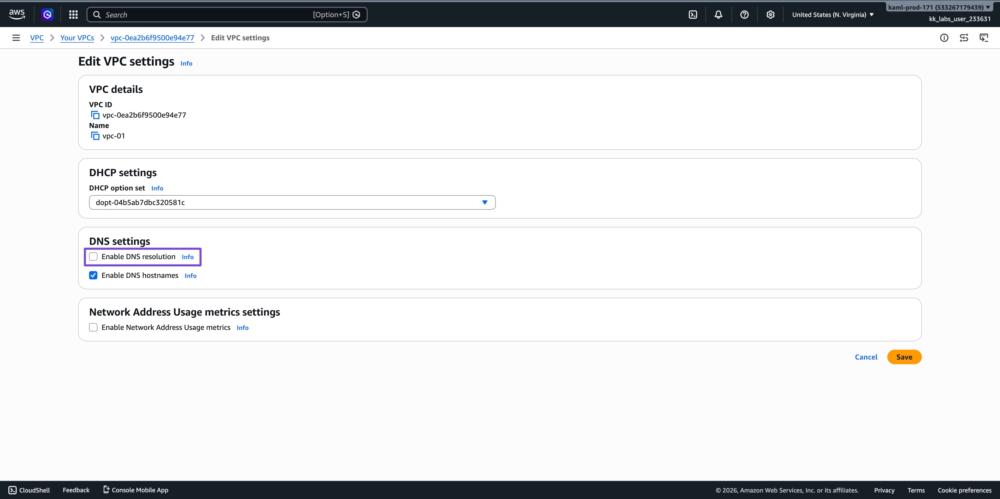
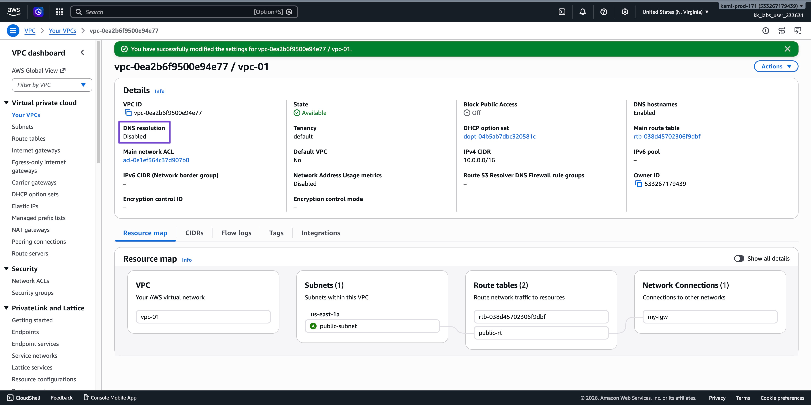

### DNS Resolution

```shell
[ec2-user@ip-10-0-1-103 ~]$ cat /etc/resolv.conf
# This is /run/systemd/resolve/resolv.conf managed by man:systemd-resolved(8).
# Do not edit.
#
# This file might be symlinked as /etc/resolv.conf. If you're looking at
# /etc/resolv.conf and seeing this text, you have followed the symlink.
#
# This is a dynamic resolv.conf file for connecting local clients directly to
# all known uplink DNS servers. This file lists all configured search domains.
#
# Third party programs should typically not access this file directly, but only
# through the symlink at /etc/resolv.conf. To manage man:resolv.conf(5) in a
# different way, replace this symlink by a static file or a different symlink.
#
# See man:systemd-resolved.service(8) for details about the supported modes of
# operation for /etc/resolv.conf.

nameserver 10.0.0.2
search ec2.internal

[ec2-user@ip-10-0-1-103 ~]$`
```

> Even though the DNS Resolver is disabled, the `resolv.conf` still includes the  nameserver `10.0.0.2`.

### DNS Lookup for Google

```shell
[ec2-user@ip-10-0-1-103 ~]$ nslookup google.com
;; communications error to 10.0.0.2#53: timed out
;; communications error to 10.0.0.2#53: timed out
;; communications error to 10.0.0.2#53: timed out
;; no servers could be reached
```

> Failed because we have disabled DNS resolution in the VPC settings.
