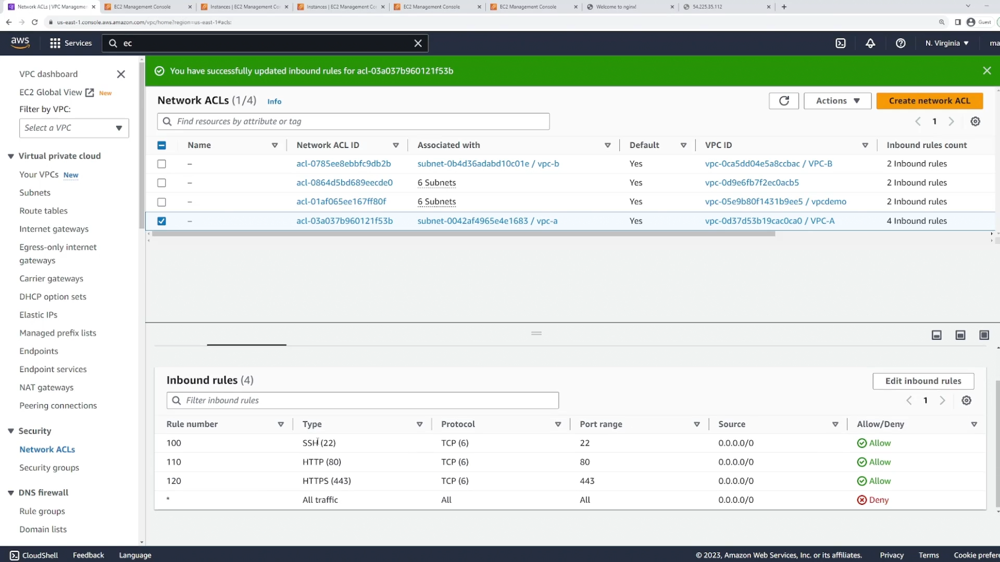
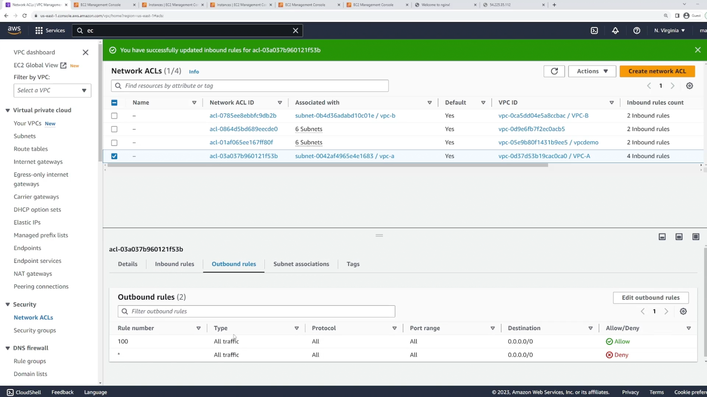
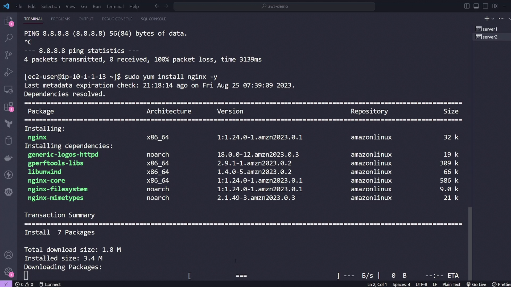
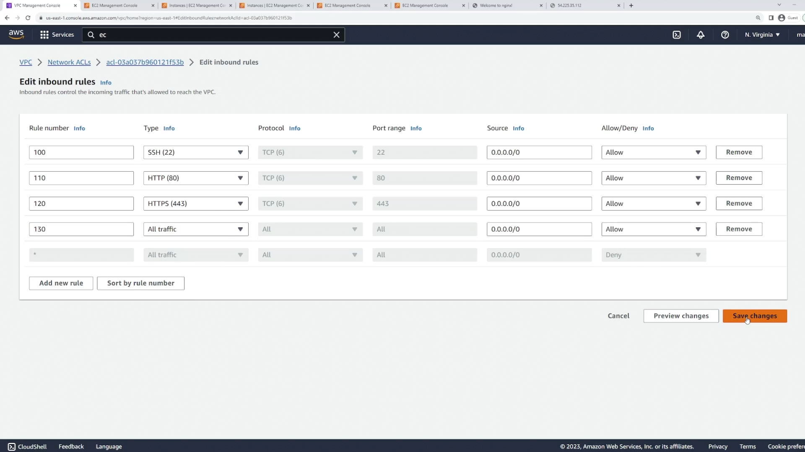
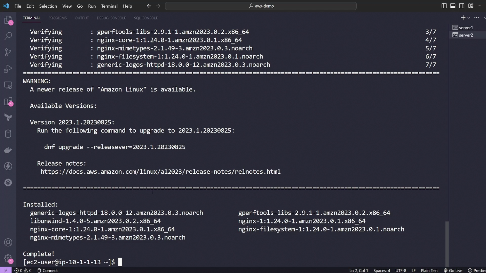
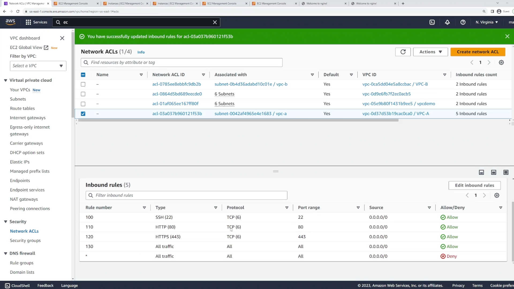
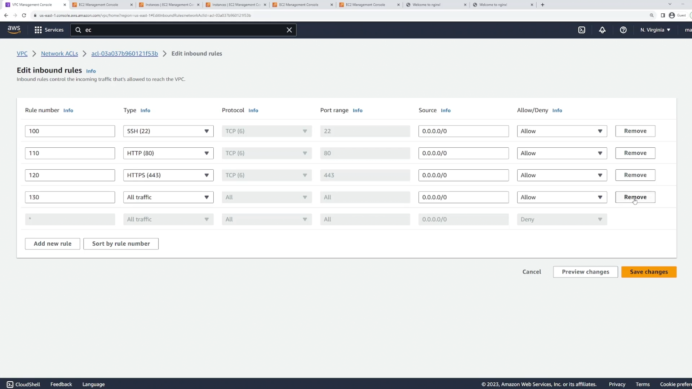
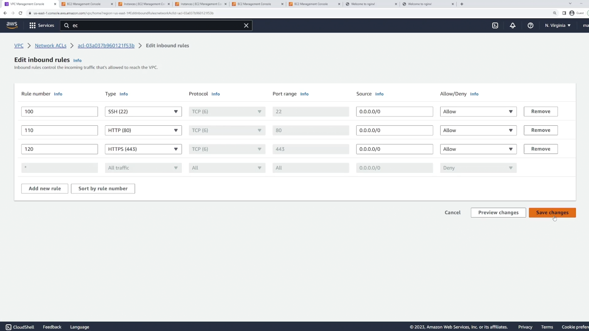

# NACLs - Demo

* NACLs operate on the subnet level, not on the resource level.
* Security groups operate on the resource level.
* NACLs support `allow` and `deny` rules.
* Security groups support only `allow` rules.

## Statelessness

### Installation of `nginx` on an Instance

* NACLs are stateless. This means that if you allow inbound traffic on a specific port, you must also allow outbound traffic on that port for the response to be allowed back in.
* In the following example, we allow all outbound traffic, but only allow inbound traffic on port 22 (SSH) and port 80 (HTTP).
* Therefore, when we try to install `nginx` on the instance, we get error because the response traffic from the instance to the client is blocked by the NACL.

### Fix

* Add an inbound rule to allow traffic from anywhere for the NACL.
* And the installation completes successfully.

### Cleanup

* As the installation is complete, now we delete the inbound rule that we added to allow traffic from anywhere.

## Multiple Rules on Same Port

* Deny inbound SSH traffic on `1.0.0.0/24` (Rule 90) and allow for all other IP addresses (Rule 100).
